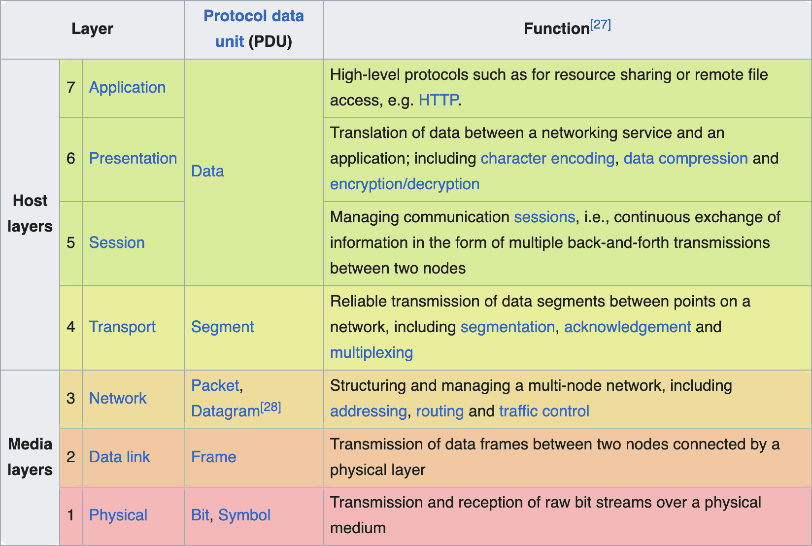
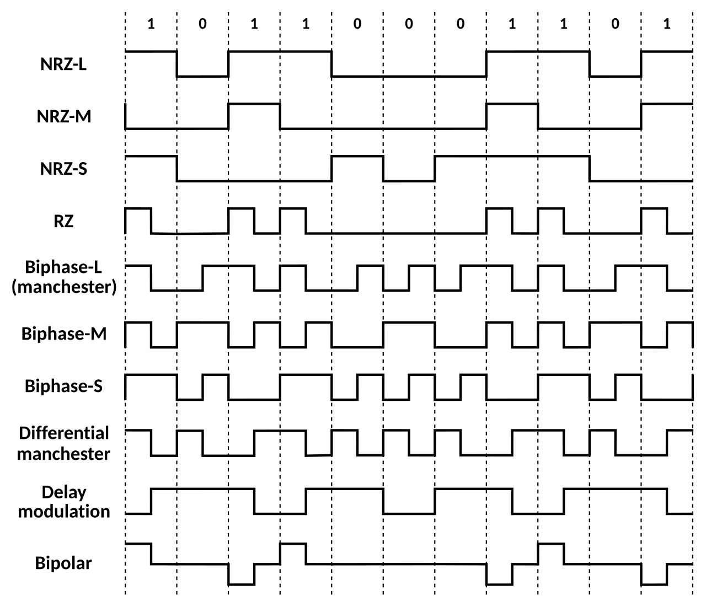
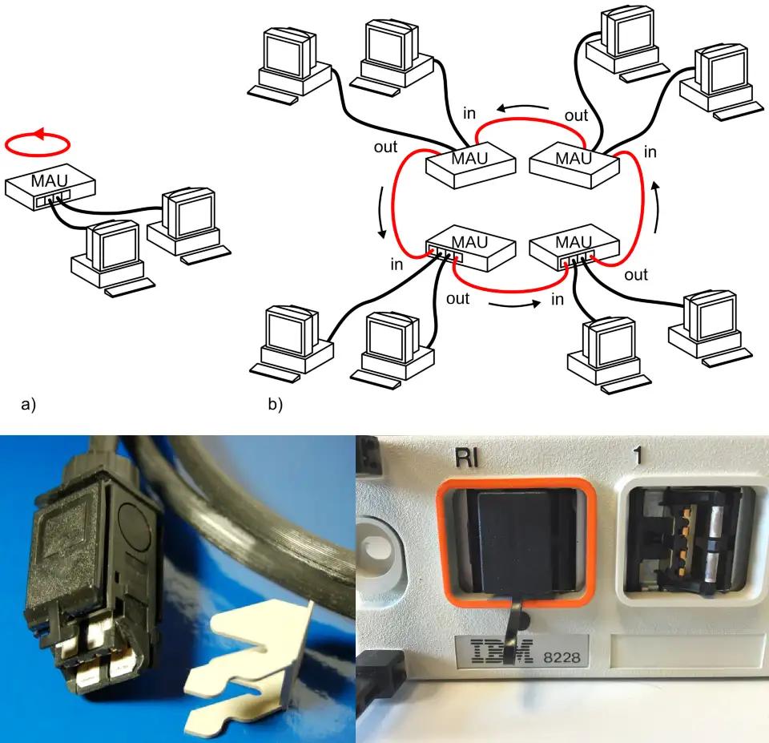
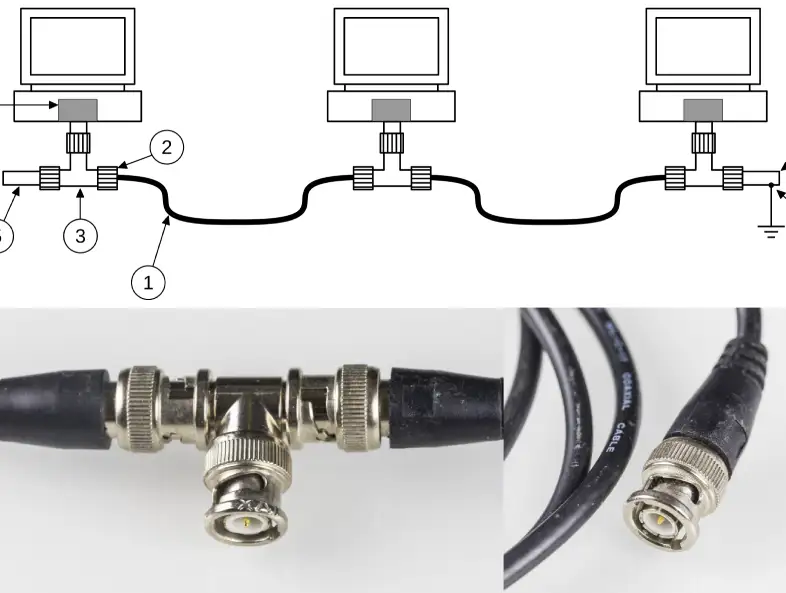
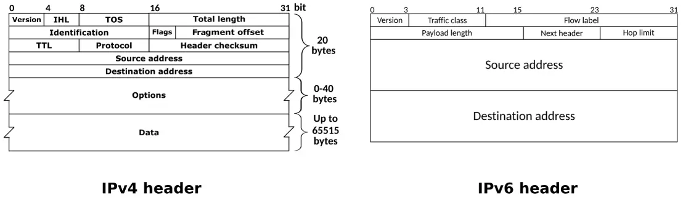
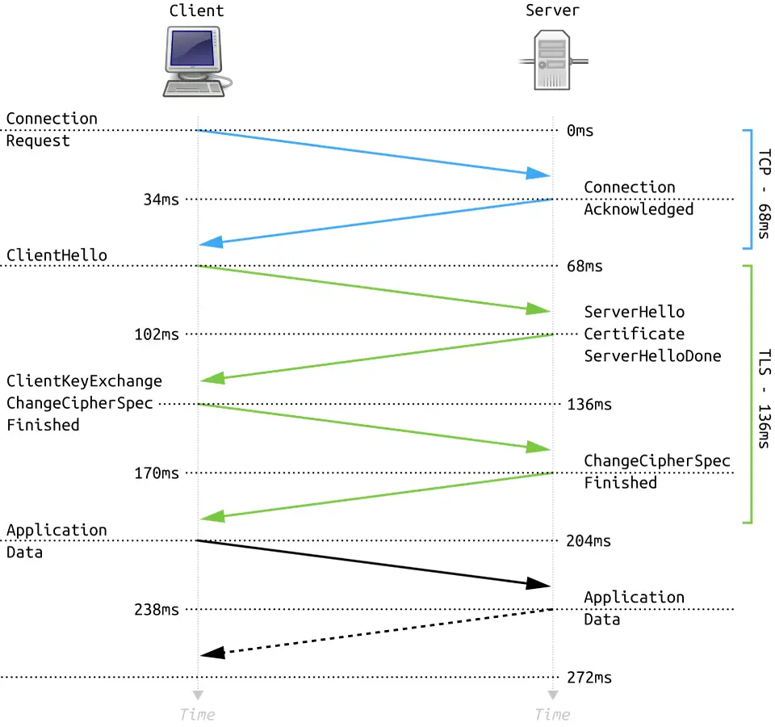

# Networking

## How it started...

- In the dark ages, each major computing vendor had their own proprietary networking.
    - Remember: this was before PCs were popular; we're mostly talking [mainframes](https://en.wikipedia.org/wiki/Mainframe_computer), [minicomputers](https://en.wikipedia.org/wiki/Minicomputer), and *early* workstations
    - [IBM's SNA](https://en.wikipedia.org/wiki/Systems_Network_Architecture) didn't talk with [DEC's DECnet](https://en.wikipedia.org/wiki/DECnet) which didn't talk with [Xerox's XNS](https://en.wikipedia.org/wiki/Xerox_Network_Systems)
    - IBM used [EBCDIC](https://en.wikipedia.org/wiki/EBCDIC) character encoding, most others used [ASCII](https://en.wikipedia.org/wiki/ASCII).
- In the late 70s/early 80s, the ISO standardized a conceptual model for how networking *should* work: [the OSI model](https://en.wikipedia.org/wiki/OSI_model)
    - OSI = Open Systems Interconnection
    - A global effort! Standardization started in France, prototyped in UK universities, defined as OSI model in USA.
    - not a protocol or a spec but a *conceptual model*
        - way of thinking so you can break down the big complicated challenges of digital communication into smaller specific domains
        - each layer has one job and *generally* only "talks" to the layers immediately above and below it

---

## OSI model overview

The 7 layers, bottom to top:

1. [Physical](https://en.wikipedia.org/wiki/Physical_layer): bits as physical signals in transit
    - voltages on copper cable, radio waves in the air, light pulses on fiber optic cables
    - physical connectors, cable/frequency specs, [signal modulation](https://en.wikipedia.org/wiki/Signal_modulation), and clock sync/timing are relevant here
    

2. [Data Link](https://en.wikipedia.org/wiki/Data_link_layer): frames between directly-connected devices
    - a "frame" contains a packet of data wrapped for only ONE hop between physical devices
    - this is where [Xerox PARC's Ethernet](https://en.wikipedia.org/wiki/Ethernet) vs [IBM's Token Ring](https://en.wikipedia.org/wiki/Token_Ring) is relevant.
        - Token Ring = a token moves around the ring; only the device holding the token can transmit
        
        - Ethernet = all devices share the medium; devices have to deal with collisions when two transmit at the same time
        
        - Token Ring may seem better on paper, but…
            - Ethernet got faster and cheaper
            - [10BASE-T](https://en.wikipedia.org/wiki/Ethernet_over_twisted_pair) introduced [full duplex](https://en.wikipedia.org/wiki/Duplex_(telecommunications)#FULL-DUPLEX) mode to transmit and receive at the same time, and pushed from bus to star topology with [network switches](https://en.wikipedia.org/wiki/Network_switch), significantly reducing collisions
        - we'll mostly assume Ethernet from here on…
    - each frame is addressed to the next device by its [MAC address](https://en.wikipedia.org/wiki/Medium_access_control)
    - device at each hop strips the frame wrapper, reads the packet, determines the next hop in the route, and re-wraps the packet as a frame for the next hop
    - [error detection](https://en.wikipedia.org/wiki/Frame_check_sequence) uses a [CRC](https://en.wikipedia.org/wiki/Cyclic_redundancy_check) checksum on the end of each frame
    

3. [Network](https://en.wikipedia.org/wiki/Network_layer): routing packets across multiple hops
    - [IP](https://en.wikipedia.org/wiki/Internet_Protocol) addresses and packet routing (not just intra-network device hops) live here
    - more on "packets" in the next section…

4. [Transport](https://en.wikipedia.org/wiki/Transport_layer): end-to-end delivery between two processes
    - TCP and UDP live here; more on them in later section…

5. [Session](https://en.wikipedia.org/wiki/Session_layer): managing the lifecycle of a conversation between two hosts
    - sometimes it's unclear where "session management" lives in the OSI stack
        - TCP (generally considered layer 4) tracks connection/handshake state
        - TLS (generally considered layer 6) can resume negotiated sessions

6. [Presentation](https://en.wikipedia.org/wiki/Presentation_layer): encoding, encryption, compression
    - [TLS](https://en.wikipedia.org/wiki/Transport_Layer_Security) is *generally* considered to live here
        - …despite the maybe confusing name "*Transport Layer* Security"
        - it runs on top of TCP/IP, but has its own handshake like a transport-layer protocol.
    - [serializing](https://en.wikipedia.org/wiki/Serialization)/[marshalling](https://en.wikipedia.org/wiki/Marshalling_(computer_science))/pickling of objects lives here
    - stream encoding/compression like [LZW](https://en.wikipedia.org/wiki/Lempel%E2%80%93Ziv%E2%80%93Welch) live here

7. [Application](https://en.wikipedia.org/wiki/Application_layer): what your program actually sees
    - [HTTP](https://en.wikipedia.org/wiki/Hypertext_Transfer_Protocol), [SSH](https://en.wikipedia.org/wiki/Secure_Shell), [DNS](https://en.wikipedia.org/wiki/Domain_Name_System), [SMTP](https://en.wikipedia.org/wiki/Simple_Mail_Transfer_Protocol), etc.

Some popular mnemonics…

- "Please Do Not Throw Sausage Pizza Away" (bottom to top)
- "All People Seem To Need Data Processing" (top to bottom)

---

## How data actually moves

### Low-level stuff: packets, addresses, routing

- old telephone networks used [circuit switching](https://en.wikipedia.org/wiki/Circuit_switching)
    - there was a dedicated physical path between two people for the whole call
    - in the early days, this involved a [switchboard operator](https://en.wikipedia.org/wiki/Switchboard_operator)
    
    - manual [telephone switchboards](https://en.wikipedia.org/wiki/Telephone_switchboard) were replaced with [electronic switching systems](https://en.wikipedia.org/wiki/Electronic_switching_system); same principle but faster
    - eventually went digital with [time-division multiplexing](https://en.wikipedia.org/wiki/Time-division_multiplexing) which shared the same physical lines with multiple calls by slicing the time spent on each call to increase capacity.
    - most phones today use [VoIP](https://en.wikipedia.org/wiki/Voice_over_IP) plus additional tech for cell signals
- internet uses [packet switching](https://en.wikipedia.org/wiki/Packet_switching)
    - large data is chopped into small chunks (packets)
    - each packet has a source and destination
    - each packet finds its own way through the network independently
    - much more efficient, but packets could arrive out of order, or not at all!
- Routers along the way maintain **routing tables**
    - "to reach this range of addresses, send the packet here"
- Two key addresses on every packet:
    - **IP address**: which machine (Layer 3)
    - **Port number**: which *process* on that machine (Layer 4)
- IPv4 and IPv6 define their packets (and addresses) differently
    

### TCP vs UDP

- Problem: packets get lost, arrive out of order, or arrive corrupted!
- Solution: …depends on the circumstances.

[TCP (Transmission Control Protocol)](https://en.wikipedia.org/wiki/Transmission_Control_Protocol)

- "I need a receipt for every package!"
    - reliable, ordered, error-checked
- uses a **three-way handshake** to establish a connection:
    - Client → Server: `SYN` ("I want to talk")
    - Server → Client: `SYN-ACK` ("I heard you, I'm ready")
    - Client → Server: `ACK` ("Great, let's go")
- every packet gets a sequence number, the receiver sends acknowledgments, and missing pieces are retransmitted
- also handles **flow control** (don't send faster than I can receive) and **congestion control** (don't flood the network)
- when do you want TCP?
    - anywhere losing or reordering data would be catastrophic
    - HTTP/HTTPS, email, file transfer, SSH

[UDP (User Datagram Protocol)](https://en.wikipedia.org/wiki/User_Datagram_Protocol)

- "Just throw it and hope they catch it."
    - no acknowledgment, no ordering guarantees
- Why???
    - TCP's overhead can be expensive
    - handshake, ACKs, the retransmissions add latency
- **DNS lookup** is the canonical UDP example
    - Your machine asks "what IP address is `example.com`?" and expects an answer in milliseconds. If the reply doesn't arrive, just ask again. No need for a full TCP connection.
    - Since DNS is UDP, a misconfigured or unreachable DNS server *fails silently* which is why DNS config is one of the first things to check when something mysteriously stops working.
- when else do you want UDP?
    - when minimum latency is important, and it's okay to lose some data
    - audio/video streaming (a dropped frame is barely noticed), some online games, VoIP

### Handshaking and Security

- TCP handshake just establishes *that* a connection exists
    - says nothing about *who* you're talking to
    - does not protect from eavesdropping
- Plaintext traffic can be intercepted, read, and manipulated between the users
    - see [Wireshark](https://wiki.wireshark.org/) for local packet sniffing
- [TLS (Transport Layer Security)](https://en.wikipedia.org/wiki/Transport_Layer_Security) adds an additional handshake on top of TCP to negotiate encryption *before* any application data flows
    - server presents a certificate (signed by a trusted authority) proving it is who it claims to be
    - client and server negotiate a shared encryption key using [public-key/asymmetric cryptography](https://en.wikipedia.org/wiki/Public-key_cryptography)
    - All subsequent data is encrypted with that key
- This is how modern HTTPS works: HTTP runs inside a TLS tunnel

- That's TLS 1.2. TLS 1.3 may have 1 round trip instead of 2 (green lines) if the client correctly guesses the server's cipher suite.

What is the public-key/asymmetric cryptography in TLS?

- "certificates" contain a public key derived from advanced prime-number math
- asymmetric crypto (using those public keys) authenticates the server and establishes a faster shared symmetric key that is used to encrypt the actual data
- see also: [Diffie-Hellman key exchange](https://en.wikipedia.org/wiki/Diffie%E2%80%93Hellman_key_exchange)
- more explanation in a future session if wanted!

---

## Wireless Networking

### Wireless Basics

- Critical security note:
    - Ethernet is easy to secure physically since the signal (basically) never leaves the wire
    - Wireless broadcasts radio waves in all directions
    - That means everyone nearby sees all your wireless data!
- [Wi-Fi](https://en.wikipedia.org/wiki/Wi-Fi)
    - trademarked brand name that implements [IEEE 802.11](https://en.wikipedia.org/wiki/IEEE_802.11)
        - 802.11 defines physical layer protocols for wireless LAN
    - operates on unlicensed radio frequency bands (2.4 GHz, 5 GHz, 6 GHz)
    - 2.4 GHz = longer range, better wall penetration, probably more congested
        - overlaps with microwaves, Bluetooth, other small radio devices
    - 5 and 6 GHz = shorter range, less congested, faster throughput
- [SSID (Service Set Identifier)](https://en.wikipedia.org/wiki/Service_set_(802.11_network)#SSID)
    - this is a local wi-fi network's name
    - wi-fi router is constantly broadcasting [beacon frames](https://en.wikipedia.org/wiki/Beacon_frame) saying "I exist, my name is X, here's what I support."
        - note: "hidden" SSIDs don't actually hide the network; they just omit the name from beacon frames

What actually happens when you join a network:

1. your device scans for beacon frames and picks one (or you pick manually)
2. "authentication" = your device handshakes with a password/key with the access point
3. "association" = the access point formally accepts your device
4. DHCP = the router assigns an IP address, gives you the gateway and DNS server addresses

What about Bluetooth?

- designed for *short-range* wireless communication
    - e.g. headphones, keyboards, game controllers, phones, *sometimes* computers
- also ~2.4 GHz, but MUCH lower power and lower throughput
    - Bluetooth ~2.5 milliwatts vs 802.11ax ~100-4000 milliwatts (yes, 4 watts!)
- totally different physical layer protocol
    - generally not used for TCP/IP, but is *possible*

### Wi-Fi security

[WEP (Wired Equivalent Privacy) - 1997](https://en.wikipedia.org/wiki/Wired_Equivalent_Privacy)

- first attempt at encrypting Wi-Fi
- used the [RC4](https://en.wikipedia.org/wiki/RC4) [stream cipher](https://en.wikipedia.org/wiki/Stream_cipher) with a static shared key
- the problems mostly surrounded the [initialization vector (IV)](https://en.wikipedia.org/wiki/Initialization_vector):
    - IV defines the starting value of a pseudorandom sequence
    - IV was too small (24-bit)
        - a busy network would repeat IVs in a few hours
        - an attacker could XOR encrypted packets from the same IV to see the XOR of the plaintext data
    - IV was used as part of the RC4 key
        - the per-packet RC4 key literally the IV concatenated with the WEP key
        - related IVs produce related RC4 keys, and related RC4 keys leaked WEP key bytes
    - IVs were sent in plaintext with every frame
        - an attacker could see when IVs were repeated and exploit "weak" IVs to quickly get the WEP key
- WEP also used CRC-32 on its frames, which isn't cryptographically secure, and strategically flipping bits in ciphertext resulted in predictable changes to the checksum
- by mid 2000s, attackers could crack WEP in minutes on a live network

[WPA (WiFi Protected Access) - 2003](https://en.wikipedia.org/wiki/Wi-Fi_Protected_Access#WPA)

- was fast-tracked as a solution that could run on existing WEP hardware (with a firmware update) while the WPA2 spec was being finalized
- attempted to address the main issues with WEP:
    - expanded from 24 to 48 bits
    - changed RC4 generation to use [TKIP (Temporal Key Integrity Protocol)](https://en.wikipedia.org/wiki/Temporal_Key_Integrity_Protocol) which combined the base key, the sender's MAC address, and a sequence counter
    - changed CRC-32 to a "MIC (Message Integrity Code)" (part of the TKIP spec, and conceptually a [MAC (message authentication code)](https://en.wikipedia.org/wiki/Message_authentication_code))

[WPA2 - 2004](https://en.wikipedia.org/wiki/Wi-Fi_Protected_Access#WPA2)

- has been the standard for 20+ years
- replaced RC4/TKIP entirely with [AES](https://en.wikipedia.org/wiki/Advanced_Encryption_Standard)-[CCMP](https://en.wikipedia.org/wiki/CCMP_(cryptography)) (modern [block cipher](https://en.wikipedia.org/wiki/Block_cipher) + mode of operation) that's still considered secure
- offers two modes:
    - "Personal (PSK)": one shared password for everyone (typical home use)
    - "Enterprise (802.1X)": each user authenticates individually, typically against a RADIUS server (typical office/enterprise use)
- is subject to at least one known weakness:
    - if someone captures your *initial* handshake, they can offline dictionary/brute force attack your password

[WPA3 - 2018](https://en.wikipedia.org/wiki/Wi-Fi_Protected_Access#WPA3)

- introduces a fix for the handshake capture offline attack
- not widely supported on hardware yet
- slow rollout presumably because WPA2 + strong passwords is good enough

---

## Next session ideas?

- What about private IP ranges? What about NAT? How do they compare with and navigate to public IP addresses?
    - e.g. `192.168.x.x`, `10.x.x.x`, `172.16.x.x`
- What are some behavioral differences between IPv4 and IPv6?
- Look at some local networking tools:
    - ip addr, ping, traceroute/tracepath, ss/netstat, dig/nslookup
- More in-depth info about public-key cryptography?
    - Why are primes special and how are they used?
    - How are keys exchanged securely?
    - How is "signing" different from encrypting?
